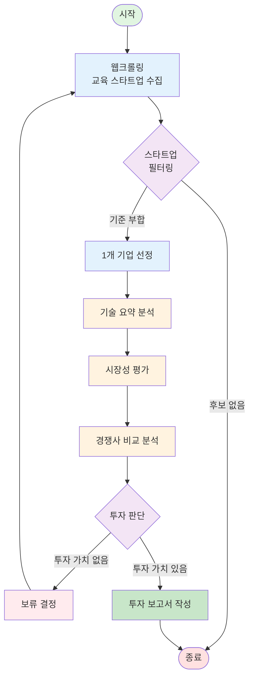

# AI Startup Investment Evaluation Agent
본 프로젝트는 교육 도메인의 AI 스타트업에 대한 투자 가능성을 자동으로 평가하는 에이전트를 설계하고 구현한 실습 프로젝트입니다.

## Overview

- Objective : 교육 분야 기업중 AI 스타트업의 기술력, 교육 학습 성과, 시장성, 경쟁 기업과 비교, 성장 가능성, 리스크를 기준으로 투자 적합성 분석
- Method : AI Agent + Agentic RAG 
- Tools : Tavily, 

## Features

- PDF 자료 기반 정보 추출 (예: IR 자료, 기사 등)
- 투자 기준별 판단 분류 (시장성, 팀, 기술력 등)
- 종합 투자 요약 출력 (예: 투자 유망 / 보류 / 회피)

## Tech Stack 

| Category   | Details                      |
|------------|------------------------------|
| Framework  | LangGraph, LangChain, Python |
| LLM        | GPT-4o-mini via OpenAI API   |
| Retrieval  | FAISS, Chroma                |
| Embedding  | OpenAI, multilingual-e5-large|

## Agents
 
- Agent A: 웹 크롤링을 통해 교육 AI 스타트업들의 목록을 긁어온다.
- Agent B: 목적, 성장 속도, 아이디어, 불확실성, 자금 조달, 최종 목표를 기준으로 스타트업인지 판단한다.
-------------------------------------------------
- Agent C: 선정된 스타트업의 기술력을 분석한다.
- Agnet D: 선정된 스타트업의 교육 학습 성과를 분석한다.
- Agent E: 선정된 스타트업의 시장성을 분석한다.
- Agent F: 선정된 스타트업의 경쟁사와 비교한다.
- Agent G: 선정된 스타트업의 성장 가능성을 분석한다.
- Agent H: 선정된 스타트업의 리스크를 평가한다.
--------------------------------------------------
- Agent I: 총합 점수를 통해 보류할지 투자할지 판단한다.
- Agent J: 보류 결정이면 다시 Agnet B로, 투자 결정이면 해당 스타트업의 분석을 보고서로 작성한다.

## Architecture

## Directory Structure
├── data/                  # 스타트업 PDF 문서
├── agents/                # 평가 기준별 Agent 모듈
├── prompts/               # 프롬프트 템플릿
├── outputs/               # 평가 결과 저장
├── app.py                 # 실행 스크립트
└── README.md

## Contributors 
- 김지은 : Agent Design 
- 심경호 : Prompt Engineering, PDF Parsing
- 최휘윤 : Filtering/Selection Agent
- 송재령 : Retrieval Agent

