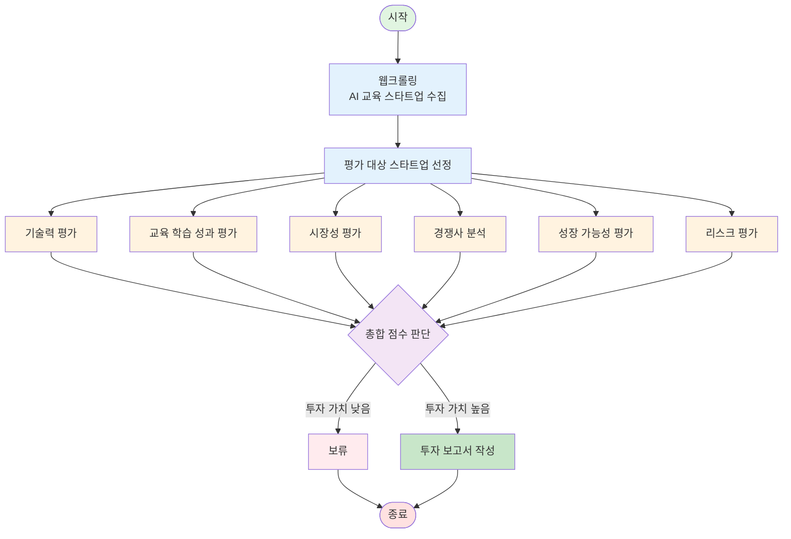

# AI Startup Investment Evaluation Agent
본 프로젝트는 교육 도메인의 AI 스타트업에 대한 투자 가능성을 자동으로 평가하는 에이전트를 설계하고 구현한 실습 프로젝트입니다.

## Overview
- Objective : 교육 분야 기업중 AI 스타트업의 기술력, 교육 학습 성과, 시장성, 경쟁 기업과 비교, 성장 가능성, 리스크를 기준으로 투자 적합성 분석
- Method : AI Agent + Agentic RAG
- Tools : Tavily, OpenAI, LangChain, LangGraph

## Features

- PDF 자료 기반 정보 추출 (예: IR 자료, 기사 등)
- 투자 기준별 판단 분류 (시장성, 팀, 기술력 등)
- 종합 투자 요약 출력 (예: 투자 유망 / 보류 / 회피)

## Tech Stack 

| Category  | Details                         |
| --------- | ------------------------------- |
| Framework | LangGraph, LangChain, Python    |
| LLM       | GPT-4o-mini (via OpenAI API)    |
| Embedding | text-embedding-3-small (OpenAI) |
| Search    | Tavily API (Advanced search)    |
| Storage   | CSV (pandas), Local filesystem  |

## Agents
 
- Web_Crawling_Agent: 웹 크롤링을 통해 교육 AI 스타트업들의 목록을 긁어온다.
- Select_Agent: 목적, 성장 속도, 아이디어, 불확실성, 자금 조달, 최종 목표를 기준으로 스타트업인지 판단한다.
-------------------------------------------------
- Tech_Anal_Agent: 선정된 스타트업의 기술력을 분석한다.
- Learning_Effect_Agnet: 선정된 스타트업의 교육 학습 성과를 분석한다.
- Market_Agent: 선정된 스타트업의 시장성을 분석한다.
- Competition_Agent: 선정된 스타트업의 경쟁사와 비교한다.
- Growth_Potential_Agent: 선정된 스타트업의 성장 가능성을 분석한다.
- Risk_Assesment_Agent: 선정된 스타트업의 리스크를 평가한다.
--------------------------------------------------
- Judgment_Agent: 총합 점수를 통해 보류할지 투자할지 판단한다.
- Repot_Agent: 보류 결정이면 다시 Agnet B로, 투자 결정이면 해당 스타트업의 분석을 보고서로 작성한다.

## Architecture

## Score
**점수 현황:**
- 기술력: {tech}/100 (가중치 20%)
- 학습효과: {learning}/100 (가중치 20%)
- 시장성: {market}/100 (가중치 25%)
- 경쟁력: {competition}/100 (가중치 15%)
- 성장가능성: {growth}/100 (가중치 10%)
- 리스크: {risk}/100 (가중치 10%, 높을수록 안전)

## Directory Structure
├── data/                  # 스타트업 list 문서
├── agents/                # 평가 기준별 Agent 모듈
├── outputs/               # 평가 결과 저장
├── app.py                 # 실행 스크립트
└── README.md

## Contributors 
- 김지은 : Evaluation Agent Design
- 심경호 : Prompt Engineering, Architecture Design
- 최휘윤 : Filtering/Selection Agent
- 송재령 : Retrieval agent

